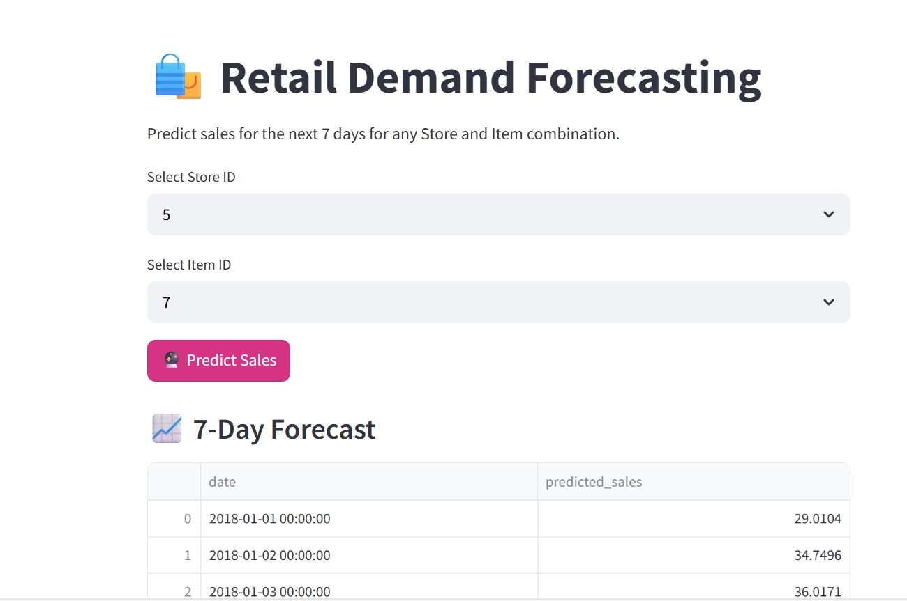
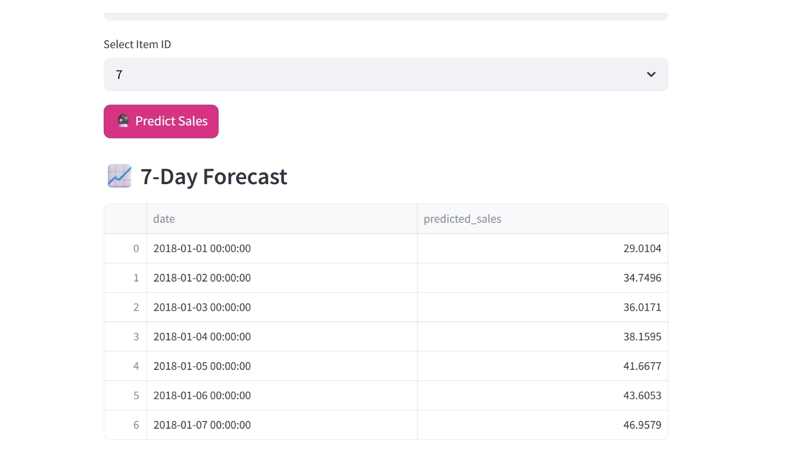

# 🛒 Demand Forecasting using Machine Learning

This project predicts product demand (sales) across multiple retail stores using historical data. It helps businesses optimize inventory by forecasting future sales.

## 🧠 Project Overview

The goal was to forecast daily sales using both **Machine Learning (RandomForestRegressor)** and **Deep Learning (LSTM)** models. After comparing both, the **RandomForestRegressor outperformed LSTM** in accuracy and stability, and was chosen to power the final **Streamlit web app**.

Key stages:

* Data preprocessing and feature engineering
* Lag features to capture past sales behavior
* Holiday and weekend effects
* Cyclical date encoding (month as sine/cosine)
* Model training, evaluation, and deployment

## 📊 ML vs DL Comparison

* **RandomForestRegressor**:

  * Used RandomizedSearchCV for hyperparameter tuning
  * Handled feature-rich, non-sequential data well
* **LSTM**:

  * Trained using 30-day sales sequences
  * Underperformed due to dataset limitations

✅ Final app forecasts 7-day sales for any selected `store_id` and `item_id`, with interactive visualizations built using **Streamlit** and **Plotly**.

------

Note: The trained RandomForest model (.pkl) is not included in this repository due to GitHub's file size limitations. Please train the model using the provided notebook.

-------
Screenshort of the app

.png)

